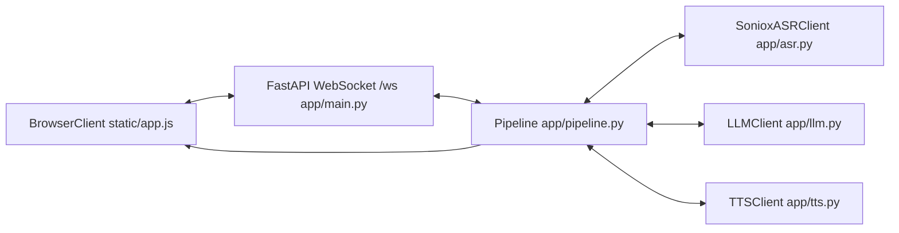
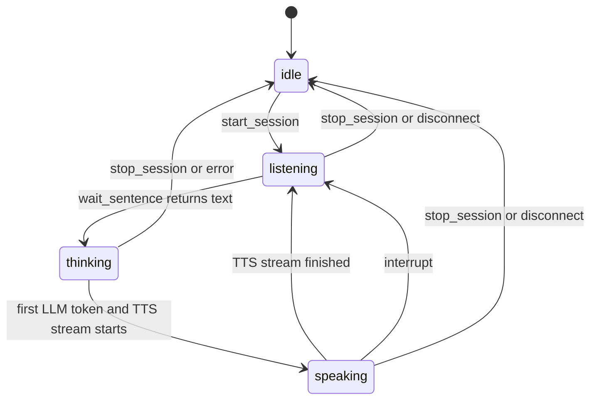
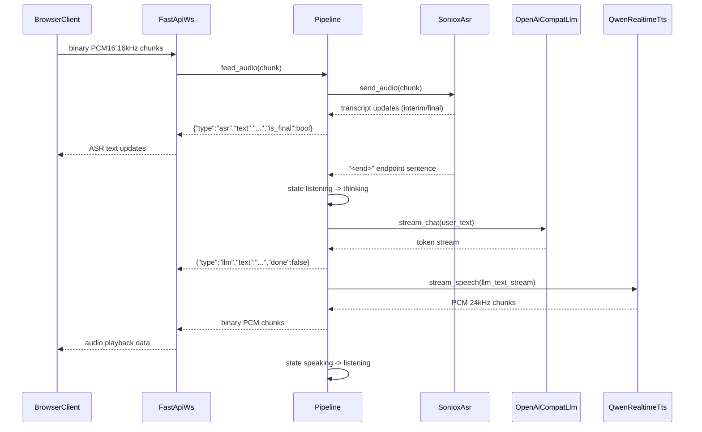

# TinyVoice Architecture

TinyVoice is a real-time voice agent built with a three-stage pipeline: ASR -> LLM -> TTS. The browser streams microphone PCM audio to the backend, the backend detects utterance boundaries from ASR semantic endpoints, then streams generated text and synthesized audio back to the browser.

## System Architecture

## Pipeline State Machine

## End-to-End Turn Sequence

## Module Responsibilities

- `app/config.py`
  - Loads `.env` via `pydantic-settings`.
  - Exposes `get_settings()` with `lru_cache` to avoid repeated parsing.
  - Provides readiness checks: `asr_configured()`, `llm_configured()`, `tts_configured()`.

- `app/main.py`
  - Hosts static assets and the `/ws` WebSocket endpoint.
  - Parses control messages: `start_session`, `stop_session`, `interrupt`.
  - Forwards binary audio frames to pipeline and handles disconnect/runtime exceptions.

- `app/pipeline.py`
  - Owns session lifecycle and state machine: `idle`, `listening`, `thinking`, `speaking`.
  - Runs ASR forwarder tasks (audio input + transcript output) and per-turn LLM/TTS task.
  - Handles interruption by cancelling TTS synthesis first (`tts.cancel()`) then cancelling the turn task, ensuring the DashScope thread exits cleanly instead of leaking.

- `app/asr.py`
  - Connects to Soniox realtime ASR WebSocket with endpoint detection enabled.
  - Maintains per-utterance `current_tokens`; when `<end>` arrives, emits `_on_sentence(...)` and clears buffer.
  - Emits transcript updates for frontend display and includes proxy fallback logic.

- `app/llm.py`
  - Uses `AsyncOpenAI` in OpenAI-compatible mode (`base_url`, `api_key`, `model`).
  - Streams assistant tokens and keeps conversation history with a Chinese speech-friendly system prompt.

- `app/tts.py`
  - Wraps sync DashScope realtime TTS SDK in a background thread.
  - Uses `queue.Queue` for text/audio bridging and yields PCM chunks asynchronously.
  - Uses cloned voice via `TTS_VOICE_ID`.
  - Supports mid-stream cancellation: `cancel()` sends `cancel_response` to DashScope and closes the WebSocket, stopping synthesis immediately. A shared `threading.Event` coordinates cancellation across the async caller and the sync TTS thread.

- `static/app.js`
  - Captures microphone audio with AudioWorklet and downsamples to 16kHz PCM for ASR.
  - Plays returned TTS PCM by converting int16 -> float32 and resampling 24kHz to `AudioContext` rate.
  - Renders streaming ASR/LLM text and sends WebSocket control messages.

## WebSocket Protocol

Browser -> Server:
- Binary frame: microphone PCM audio.
- JSON control:
  - `{"type":"start_session"}`
  - `{"type":"stop_session"}`
  - `{"type":"interrupt"}`

Server -> Browser:
- `{"type":"state","state":"idle|listening|thinking|speaking"}`
- `{"type":"asr","text":"...","is_final":true|false}`
- `{"type":"llm","text":"...","done":true|false}`
- Binary frame: TTS PCM audio (24kHz mono 16-bit).

## Audio Formats

- Capture path: Browser microphone -> 16kHz PCM s16le mono -> Soniox ASR.
- Synthesis path: Qwen TTS -> 24kHz PCM mono 16-bit -> browser resample -> speaker.

## Interrupt / Barge-in Flow

When a user interrupts during TTS playback, the pipeline:

1. Calls `tts.cancel()` which sends `response.cancel` to DashScope then closes the WebSocket.
2. The `on_close` callback puts `None` into `audio_queue`, signalling the async audio consumer to stop.
3. The background TTS thread detects the `cancel_event` and exits without waiting for synthesis to finish.
4. The pipeline cancels the turn task and transitions back to `listening`.

This avoids orphaned threads, wasted DashScope synthesis, and stale audio data in the queue.

## Design Trade-offs

- DashScope realtime TTS SDK is synchronous, so backend uses a thread bridge instead of pure async API calls.
- Soniox connection may be affected by system SOCKS proxy setup; ASR client retries with `proxy=None` fallback when needed.
- TTS cancellation uses a shared `threading.Event` plus direct SDK calls (`cancel_response` / `close`) to coordinate across async and threaded code, since the sync SDK cannot be awaited.
